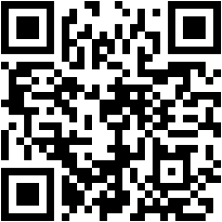

### Hi there 👋

I'm a computer science student
from bavaria :beers: who loves simplifying life with `automation` :robot:.

- 📫 kastldratza(at)protonmail.com

---

## Support
Feel free. However, if you want to support me and my work, I have some crypto addresses here.

name | address |
------------ | ------------- |
Bitcoin (BTC) | <details><summary>show</summary><p> <br> ```bc1qz2n26d4gq8qjdge9ueeluqut5p0rmv5wjmvnus``` </p></details>
Ethereum (ETH) | <details><summary>show</summary><p> <br> ```0x984dBf7fb4ab489E33ca004552259484041AeF88``` </p></details>

<!--
**kastldratza/kastldratza** is a ✨ _special_ ✨ repository because its `README.md` (this file) appears on your GitHub profile.

Here are some ideas to get you started:

- 🔭 I’m currently working on ...
- 🌱 I’m currently learning ...
- 👯 I’m looking to collaborate on ...
- 🤔 I’m looking for help with ...
- 💬 Ask me about ...
- 📫 How to reach me: ...
- 😄 Pronouns: ...
- ⚡ Fun fact: ...
-->
